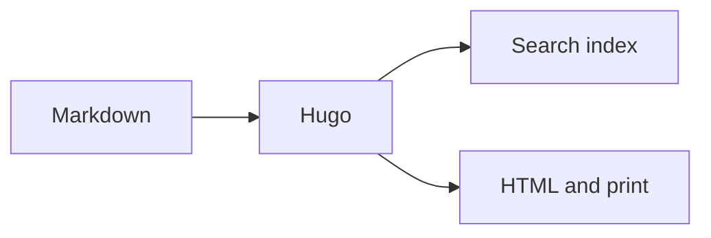
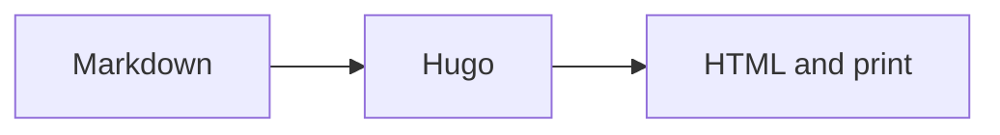
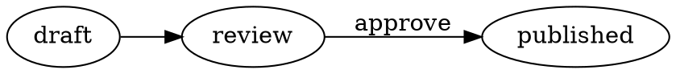

# Diagrams and Charts

> Create responsive diagrams, data-driven charts and generated vector figures.


The theme accepts diagram source and chart data directly in Markdown, from a
project file, or from an explicitly supplied build-time URL. Each source is
passed to a domain-specific renderer and becomes inline SVG or semantic HTML.
That common contract keeps text selectable and lets the page provide responsive,
accessible and printable presentation without reducing every domain to one
generic drawing language.

## Choose an authoring path

| Content | Recommended path | Accepted source | Rendering |
|---|---|---|---|
| Flow, sequence, class or state diagram | Mermaid | Fence, shortcode body, file or URL | Browser, only on pages that use it |
| Small bar, line or dot chart | `chart` | CSV file | Hugo build |
| Rich analytical chart | `plot` | Inline CSV/JSON/TOML/YAML/XML, file or URL | Browser, from build-loaded data |
| Architecture or infrastructure | D2 | Fence, `.d2` file or URL | Build-integrated SVG |
| Dependencies, trees or directed graphs | Graphviz/DOT | Fence, `.dot` file or URL | Build-integrated SVG |
| Mathematical or technical figure | [Typst graphics](typst-graphics.md) | Fence, `.typ` file or URL | Build-integrated SVG |
| Interactive mathematical construction | [JSXGraph](#interactive-mathematics-with-jsxgraph) | Inline JSON, file or URL | Browser-generated inline SVG |
| Digital timing diagram | [WaveDrom](#digital-timing-with-wavedrom) | Inline WaveJSON, file or URL | Browser-generated inline SVG |
| Chemical structure | [SMILES Drawer](#chemical-structures-from-smiles) | Inline SMILES, file or URL | Browser-generated inline SVG |
| Publication-style algorithm | [pseudocode.js](#algorithms-and-pseudocode) | Inline source, file or URL | Semantic HTML and KaTeX |
| Finished SVG, PNG, WebP or JPEG | [Images](images.md) | File | Hugo image presentation |

## Mermaid in Markdown

A [`mermaid` fence](https://mermaid.js.org/intro/) is the fastest route from an
idea to a semantic diagram. The theme loads its pinned runtime only when a page
uses Mermaid and redraws the diagram after a colour-mode change.



````md

````

The paired shortcode `…` is equivalent.
It can also load a page/global asset or fetch a source during the Hugo build.
For example, this rendering comes from `assets/graphics/request-flow.mmd`:



```md

```

A build-time URL uses the same rendering path:

```md

```

Hugo fetches the URL while building; the browser receives the Mermaid source
inside the page and does not contact that URL. Prefer a versioned,
project-controlled URL. Versions and delivery options are documented under
[Dependencies](../dependencies.md), while Mermaid syntax belongs in the
[Mermaid documentation](https://mermaid.js.org/intro/).

## Charts from CSV

The `chart` shortcode turns a two-column CSV resource into inline, accessible
SVG during the Hugo build. It adds no browser JavaScript and automatically uses
the theme's surfaces, borders, typography and colour-mode tokens.



Place shared data under `assets/`, or put it beside `index.md` in a page bundle.
The first row is a header; the first column contains labels and the second
contains positive numeric values.

```csv
Quarter,Projects
Q1,18
Q2,31
Q3,46
Q4,67
```

```md

```

The explicit title becomes the SVG's accessible name, while the caption
supplies visible context. Tooltips expose the exact label and value for every
mark.

### Line charts

Use a line when ordered values form a meaningful progression.



```md

```

### Dot charts

Use dots when the individual measurements matter more than continuity.



```md

```

## Rich charts with Plot

The static `chart` shortcode is ideal for a small, printable series. For broader
coverage, `plot` uses [Observable Plot](https://observablehq.com/plot/). It adds
tooltips, scales, grouping and richer marks while retaining responsive SVG
output and the theme's colour tokens.

Every Plot example accepts the same three build-time data paths:

- inline CSV, JSON, TOML, YAML or XML in the paired shortcode body;
- `src` pointing to `assets/` or a page-bundle resource; or
- `url` fetched and cached by Hugo, with an explicit `format`.

### Bar and grouped bar

The bar, line and area examples share `assets/data/plot-series.csv`:

```csv
quarter,projects,target
Q1,18,20
Q2,31,30
Q3,46,44
Q4,67,60
```



```md

```

Add `color="team"` when the data contains a grouping column. Plot creates the
categorical scale and legend.

### Line and area



```md


```

### Scatter plots

The scatter, histogram and box-plot examples share
`assets/data/plot-measurements.csv`:

```csv
team,latency,throughput
Core,82,510
Core,91,470
Core,76,540
Edge,48,610
Edge,55,590
Edge,43,650
Data,118,390
Data,105,420
Data,127,360
```



```md

```

### Histograms and distributions



```md

```

Box plots summarize distributions by group:



```md

```

### Heat maps

The heat map uses `assets/data/plot-heatmap.csv`:

```csv
day,hour,value
Mon,09:00,18
Mon,13:00,32
Mon,17:00,24
Tue,09:00,25
Tue,13:00,41
Tue,17:00,35
Wed,09:00,22
Wed,13:00,37
Wed,17:00,29
```



```md

```

### Inline and remote data

Inline data is useful for a small chart that belongs to one paragraph:


quarter,projects
Q1,18
Q2,31
Q3,46


```md

quarter,projects
Q1,18
Q2,31
Q3,46

```

For a build-time URL, Hugo downloads and caches the source before it writes the
page; visitors do not make the data request:

```md

```

CSV and JSON are the most portable choices. YAML, TOML and XML also work.

### More Plot charts and configuration

The theme shortcode currently exposes bar, line, area, scatter, histogram, box
and heat-map charts. Plot itself uses composable marks rather than a fixed list
of chart types. Its [capabilities overview](https://observablehq.com/plot/what-is-plot#what-can-plot-do)
and [gallery](https://observablehq.com/@observablehq/plot-gallery) demonstrate
additional possibilities such as stacked and diverging bars, rules, text,
links, arrows, vectors, density and contour plots, hexagonal bins, raster
plots, maps, trees, clusters and small multiples.

Plot can layer multiple marks and configure axes, grids, legends, colour and
opacity scales, projections and facets. It can also derive values with bin,
group, stack, normalize, window and map transforms. Consult the upstream
[marks](https://observablehq.com/plot/features/marks),
[scales](https://observablehq.com/plot/features/scales),
[transforms](https://observablehq.com/plot/features/transforms), and
[facets](https://observablehq.com/plot/features/facets) references for the
complete option set. The theme keeps its shortcode deliberately smaller so
every exposed option has consistent responsive, accessible and colour-mode
behavior.

## Build-integrated diagram fences

D2 and Graphviz/DOT are source languages rather than formats understood
by Hugo itself. The project build command therefore runs the graphics renderer
immediately before Hugo. It discovers fences and referenced source files,
hashes their content, invokes only the required external renderer, caches the
resulting SVG under `_generated/graphics/`, and then lets Hugo include that SVG
as an ordinary responsive figure.

Authors only write a fence or use `diagram` with a file or URL; they do not run
a separate conversion command or maintain a matching SVG by hand. A cached
result also lets builds proceed without the renderer until its source changes.
CI should nevertheless pin and install every renderer used by the site so a
clean build can reproduce all outputs.

### D2 architecture diagrams

[D2](https://d2lang.com/tour/intro/) is strongest for architecture,
infrastructure, service maps and data flows. It supplies automatic layout,
containers, connections, labels and multiple layout engines without manual
coordinates.

```d2 {alt="A request passes through an edge service and API to a database" caption="A compact D2 service architecture."}
direction: right
client: Client
edge: Edge service
api: Application API
db: Database {shape: cylinder}
client -> edge: HTTPS
edge -> api: authenticated request
api -> db: query
```

````md
```d2 {alt="Request processing architecture" caption="Service flow"}
direction: right
client -> edge: HTTPS
edge -> api: authenticated request
api -> db: query
```
````

#### Network topology

This deliberately compact campus example borrows the useful visual grammar of
larger operational diagrams: traffic flows top-down, boundaries group the edge,
campus zones and branch, device shapes distinguish network equipment from
hosts, and labels carry example addresses, VLANs, protocols and link capacity.
Redundant paths remain explicit without reproducing every access device. The
rendering is loaded from
`assets/graphics/network-topology.d2` and compiled as part of the Hugo build.



```md

```



#### Nested provider-style infrastructure

D2 containers naturally express account, region, VPC, availability-zone and
subnet boundaries. Icons from the
[D2 icon library](https://icons.d2lang.com/) make services recognizable while
the grouping remains ordinary D2. The example deliberately mixes icons with
plain labeled resources: an icon supports meaning but does not replace it.



```md

```



Remote icon URLs are fetched by D2 while rendering. For deterministic offline
builds, download the chosen SVG icons into the project, reference their local
paths, and commit them with the diagram source. D2 also supports
[imports](https://d2lang.com/tour/imports/) and
[variables](https://d2lang.com/tour/vars/), so teams can keep provider styles
and reusable infrastructure groups in a small local D2 library rather than
copying them into every figure.

### Graphviz graphs

[Graphviz](https://graphviz.org/documentation/) is the dependable choice for
dependency graphs, trees, finite-state relationships and machine-generated
networks. Its [DOT language](https://graphviz.org/doc/info/lang.html) describes
nodes and edges; the selected layout engine computes their geometry.

```dot {alt="A release moves from draft through review to published" caption="A directed release-state graph rendered by Graphviz."}
digraph release {
  rankdir=LR;
  draft -> review;
  review -> published [label="approve"];
  review -> draft [label="revise"];
}
```

````md

````

For a source file instead of a fence, put `.d2`, `.dot` or `.typ` in `assets/`
or a page bundle and use the same renderer:

```md

```

`url="https://example.org/system.d2"` is also accepted by the shortcode. The
pre-renderer fetches it during the build and Hugo fetches the same URL through
its resource cache. Prefer a versioned, project-controlled URL; a remote source
is deliberately an explicit build dependency and cannot work offline until its
SVG is cached.

For precision drawings, mathematical figures and the wider Typst package
ecosystem, continue with [Typst graphics and CeTZ](typst-graphics.md).

## Interactive mathematics with JSXGraph

[JSXGraph](https://jsxgraph.org/home/) renders manipulable geometry, functions,
curves, vector fields and other mathematical constructions. The theme accepts a
declarative JSON model: named elements can reference elements created earlier,
and their attributes are passed to JSXGraph.





```md

```

The same JSON can be placed directly inside the paired shortcode or loaded with
`url`. Consult the [JSXGraph API](https://jsxgraph.org/docs/) for element types,
parents and attributes; the theme does not duplicate that reference.

## Digital timing with WaveDrom

[WaveDrom](https://wavedrom.com/) turns WaveJSON into SVG timing diagrams for
clocks, signals, buses and register fields.





```md

```

Inline WaveJSON and build-time `url` input use the same shortcode.

## Chemical structures from SMILES

[SMILES Drawer](https://github.com/reymond-group/smilesDrawer) converts a
compact SMILES description into inline SVG. The textual SMILES value remains in
the document as an assistive fallback.



```text
CC(=O)OC1=CC=CC=C1C(=O)O
```

```md

```

Use `src` for a checked-in `.smi` file or `url` for an explicitly approved
build-time source.

## Algorithms and pseudocode

[pseudocode.js](https://github.com/SaswatPadhi/pseudocode.js) typesets a
LaTeX-like algorithm notation into semantic HTML and delegates formulae to
KaTeX. The result remains selectable and responds to the page typography.





```md

```

Use an inline paired shortcode for a short algorithm, or `src`/`url` for a
reusable source. See the upstream grammar for supported algorithm constructs.

## Accessibility and visual quality

- Describe the conclusion or structure in `alt`, not merely “chart” or
  “diagram”. Use an empty `alt` only for decorative artwork.
- Use `caption` for provenance, units, caveats or interpretation that benefits
  every reader.
- Do not encode meaning through colour alone. Add labels, shapes or patterns.
- Prefer a neutral or transparent SVG background. The theme provides the panel,
  border and dark-mode integration.
- Keep text large enough to read at the figure's normal content width and test
  both screen and print output.
- Treat renderer source as build input: avoid remote includes and never pass
  untrusted shortcode strings to shell commands.

Finished SVG and bitmap presentation, including trusted inline SVG and explicit
dark variants, is documented under [Images](images.md).


---
Source: https://projectious-work.github.io/brand-theme-hugo-vanilla/docs/features/diagrams/index.md
