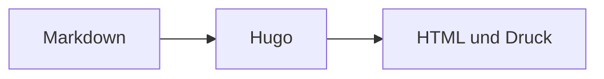

+++
title = "Diagramme und Mathematik"
description = "Mermaid-Diagramme und KaTeX-Formeln aus Markdown rendern."
weight = 56
icon = "chart-dots"
math = true
+++

[Mermaid](https://mermaid.js.org/) erzeugt Diagramme aus Text. Ein
`mermaid`-Codeblock lädt die Laufzeit nur auf Seiten, die sie benötigen.



````md

````

Für KaTeX setzen Sie `math = true` im Frontmatter. Inline-Formeln verwenden
`\\( ... \\)`; Blöcke werden von `$$` eingeschlossen.
