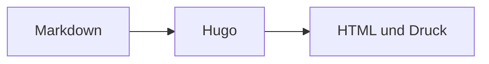

+++
title = "Diagramme"
description = "Responsive Mermaid-Diagramme aus Markdown rendern."
weight = 120
icon = "chart-dots"
+++

[Mermaid](https://mermaid.js.org/) erzeugt Diagramme aus Text. Ein
`mermaid`-Codeblock lädt die Laufzeit nur auf Seiten, die sie benötigen.



````md

````
