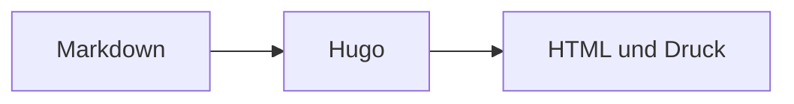

+++
title = "Diagramme und Charts"
description = "Responsive Diagramme, datenbasierte Charts sowie hochwertige Vektor- und Bitmap-Grafiken erstellen."
weight = 120
icon = "chart-dots"
+++

Die Theme bietet drei Hugo-typische Wege: Mermaid direkt in Markdown, den
Shortcode `chart` für CSV-Daten und `graphic` für SVG- oder Bitmap-Ausgaben von
D2, Graphviz, Typst/CeTZ und anderen Generatoren.

## Mermaid in Markdown

Ein `mermaid`-Codeblock lädt die fest definierte Laufzeit nur auf Seiten, die
sie benötigen.



````md

````

## Diagramme aus CSV

`chart` erzeugt beim Hugo-Build ein zugängliches Inline-SVG ohne Browser-JavaScript.



```md

```

Die erste CSV-Zeile ist die Kopfzeile. Spalte eins enthält Beschriftungen,
Spalte zwei positive Zahlen. `type` akzeptiert `bar`, `line` und `dot`.

## Generierte Vektorgrafiken

D2 eignet sich für Architektur, Graphviz für Graphen und Typst/CeTZ für präzise
technische Abbildungen. Die Werkzeuge erzeugen SVG; `graphic` übernimmt die
einheitliche, zugängliche Darstellung.



```md

```

## Inline-SVG und Bitmap

Externes SVG über `` ist der sichere Standard. Vertrauenswürdige
SVG-Ressourcen aus `assets/` oder einem Page Bundle können mit `inline="true"`
eingebettet werden. PNG, WebP und JPEG funktionieren über denselben Shortcode;
sie sind für Screenshots, Fotos und rasterintensive Darstellungen geeignet.

```md


```

Immer aussagekräftigen Alternativtext und bei Bedarf eine Bildunterschrift
angeben. Bedeutung darf nicht ausschließlich durch Farbe vermittelt werden.
