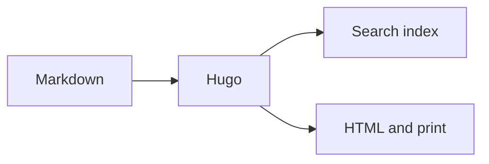
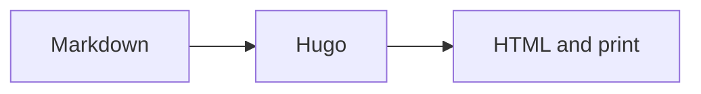

+++
title = "Diagrams and mathematics"
description = "Render Mermaid diagrams and KaTeX mathematics from Markdown."
weight = 56
icon = "chart-dots"
math = true
+++

Mermaid turns text definitions into diagrams. A `mermaid` fence or the paired
shortcode loads the pinned runtime only on pages that need it and redraws the
diagram after a colour-mode change.



````md

````

KaTeX renders LaTeX notation. Set `math = true` in the page front matter first.
Inline mathematics such as \( t_{build} < 1s \) stays in a sentence; display
mathematics gets its own block:

$$
T_{publish} = T_{build} + T_{verify} + T_{deploy}
$$

```md
+++
math = true
+++

Inline: \\( t_{build} < 1s \\)

$$
T_{publish} = T_{build} + T_{verify} + T_{deploy}
$$
```

The versions and delivery options are documented under
[Dependencies](../dependencies.md).
