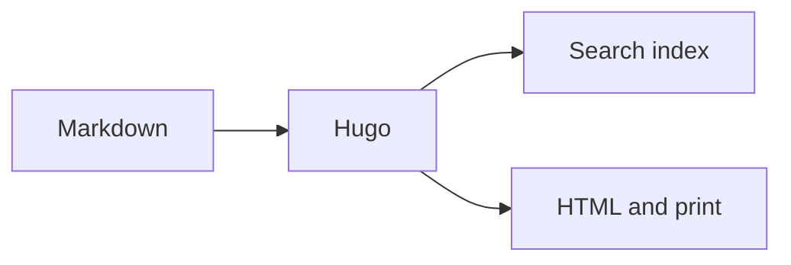
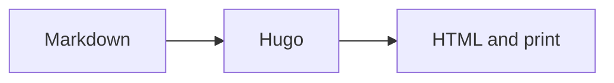

+++
title = "Diagrams"
description = "Render responsive Mermaid diagrams from Markdown."
weight = 120
icon = "chart-dots"
+++

Mermaid turns text definitions into diagrams. A `mermaid` fence or the paired
shortcode loads the pinned runtime only on pages that need it and redraws the
diagram after a colour-mode change.



````md

````

The versions and delivery options are documented under
[Dependencies](../dependencies.md).
