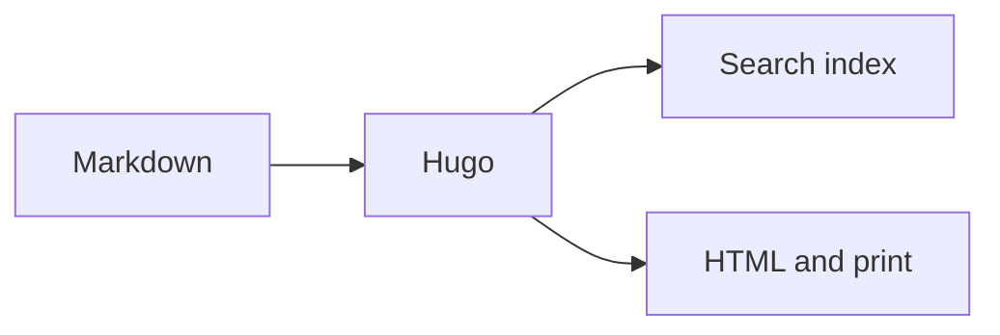
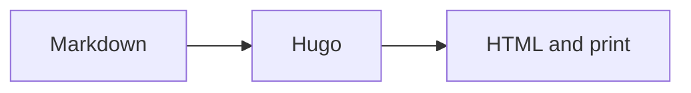

+++
title = "Content authoring guide"
linkTitle = "Guides"
overviewTitle = "Content authoring guide"
description = "Write pages, links, code, diagrams, recordings and notebook output with Hugo-friendly Markdown."
weight = 40
icon = "book"
math = true
+++

This guide is the authoritative walkthrough for authors. It uses examples from the
theme itself rather than an invented product or command-line interface.

## Create and order pages

Create a Markdown file below `content/docs/`. Use a leaf bundle when the page owns
images or downloads:

```text
content/docs/operations/
├── index.md
├── architecture.png
└── terminal.cast
```

The common front matter is deliberately small:

```toml
+++
title = "Operations"
description = "How to operate the service."
weight = 30
icon = "book"
+++
```

`weight` controls sidebar, overview-card and previous/next order. A section's child
cards are generated from `title`, `description`, `icon` and `weight`.

## Link within and between pages

Hugo generates heading IDs from heading text. Link to a heading on the current page
with a fragment:

```md
[Jump to recordings](#terminal-recordings)
```

For another page, use the Markdown filename plus the heading fragment:

```md
[Output formats](../configuration.md#output-formats)
[Search configuration](../features/search.md#configuration)
```

The theme's link render hook resolves Markdown paths through Hugo page objects. If
the target page moves, the build fails instead of silently publishing a broken
link. Use ordinary `https://` links for external sites.

## Code and terminal output

Use fenced code for source that readers may copy. Add `filename`, line numbers or
highlighted lines through fence attributes. Use the terminal shortcode for a
captured command interaction:


$ hugo --minify
✓ Content validated
✓ Search index generated
⚠ Review two external links
Build completed in 284 ms


```md

$ hugo --minify
✓ Content validated
✓ Search index generated
⚠ Review two external links
Build completed in 284 ms

```

Language fences show syntax colours without a shortcode:

```python {filename="report.py", linenos=table, hl_lines="3"}
from pathlib import Path

pages = list(Path("content").rglob("*.md"))
print(f"{len(pages)} pages ready")
```

````md
```python {filename="report.py", linenos=table, hl_lines="3"}
from pathlib import Path

pages = list(Path("content").rglob("*.md"))
print(f"{len(pages)} pages ready")
```
````

```toml {filename="hugo.toml"}
[params]
  codeTheme = "adaptive"
  sidebarOpenDepth = 1
```

````md
```toml {filename="hugo.toml"}
[params]
  codeTheme = "adaptive"
  sidebarOpenDepth = 1
```
````

### Code block options

Put the language immediately after the opening fence and options inside `{}`.
`filename` controls the theme's title bar; the remaining options are handled by
Hugo's Chroma syntax highlighter.

| Option | Values and effect |
|---|---|
| `filename="report.py"` | Theme-specific label shown above the code |
| `linenos=false` | Hide line numbers, including when enabled globally |
| `linenos=table` | Copy-friendly line-number column |
| `linenos=inline` | Put line numbers inside each highlighted line |
| `linenostart=20` | Display 20 as the first line number |
| `hl_lines=[3,"6-8"]` | Emphasize individual lines and ranges |
| `anchorlinenos=true` | Make displayed line numbers link targets |
| `lineanchors="example-"` | Prefix line-anchor IDs so multiple blocks do not collide |

```python {filename="checks.py", linenos=table, linenostart=20, hl_lines=[2,"4-5"], anchorlinenos=true, lineanchors="checks-"}
def verify(build):
    if not build.deterministic:
        raise ValueError("build output changed")

    return "ready"
```

````md
```python {filename="checks.py", linenos=table, linenostart=20, hl_lines=[2,"4-5"], anchorlinenos=true, lineanchors="checks-"}
def verify(build):
    if not build.deterministic:
        raise ValueError("build output changed")

    return "ready"
```
````

Set site-wide defaults under `[markup.highlight]` in `hugo.toml`; attributes on a
fence override them for that block. Hugo documents every supported option in its
[syntax-highlighting reference](https://gohugo.io/content-management/syntax-highlighting/).

## Diagrams and mathematics

A Mermaid fence or the paired `mermaid` shortcode renders a diagram. The runtime is
loaded only when the page contains a diagram and follows colour-mode changes.



````md

````

Set `math = true` in front matter before using KaTeX. Inline mathematics such as
\( t_{build} < 1s \) stays in the sentence; display mathematics gets its own block:

$$
T_{publish} = T_{build} + T_{verify} + T_{deploy}
$$

```md
Inline: \\( t_{build} < 1s \\)

$$
T_{publish} = T_{build} + T_{verify} + T_{deploy}
$$
```

## Terminal recordings

[asciinema](https://asciinema.org/) records a terminal session as text and timing
data rather than video. Recordings remain sharp at every size, can be copied, and
are usually much smaller than screen video. Install its recorder, run
`asciinema rec theme-tour.cast`, and place the resulting cast in a page bundle or
under `static/casts/`.



```md

```

Autoplay is disabled by default. The player version is pinned in `data/cdn.yaml`.
Its light and dark palettes follow the page colour mode.

## Jupyter notebooks

[Jupyter notebooks](https://jupyter.org/) combine prose, executable code and its
output in `.ipynb` JSON files. The theme converts notebooks before Hugo builds so
published pages remain ordinary Markdown and images.



The preview above includes the converted Python input cell and its output. The
source `.ipynb` file is JSON and is not embedded directly in a page.

Create an isolated, reproducible conversion environment and convert every
notebook:

```sh
python3 -m venv .venv
. .venv/bin/activate
pip install -r scripts/requirements.txt
./scripts/notebooks.sh
```

`scripts/requirements.txt` pins `nbconvert` and its converters so the same notebook
produces stable Markdown on developer machines and in releases. The virtual
environment keeps these Python tools out of the system installation.

Embed the converted result with ``. Notebook
shortcodes reference a converted file; they cannot execute or contain an inline
notebook. See
[Configuration](../configuration.md#notebook-conversion) for paths and lookup
rules.
