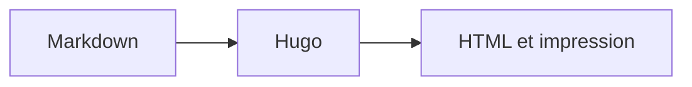

+++
title = "Diagrammes et mathématiques"
description = "Afficher des diagrammes Mermaid et des formules KaTeX."
weight = 56
icon = "chart-dots"
math = true
+++

[Mermaid](https://mermaid.js.org/) produit un diagramme depuis du texte. Un bloc
`mermaid` charge le moteur uniquement sur les pages concernées.



````md

````

Pour KaTeX, ajoutez `math = true` au front matter. Utilisez `\\( ... \\)` en
ligne et `$$` autour d'une formule en bloc.
