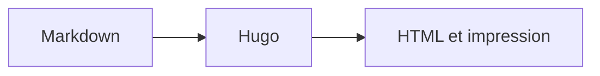

+++
title = "Diagrammes et graphiques"
description = "Créer des diagrammes responsives, des graphiques issus de données et des figures vectorielles ou bitmap soignées."
weight = 120
icon = "chart-dots"
+++

Le thème propose trois parcours idiomatiques Hugo : Mermaid directement dans
Markdown, le shortcode `chart` pour les données CSV et `graphic` pour les sorties
SVG ou bitmap de D2, Graphviz, Typst/CeTZ et d'autres générateurs.

## Mermaid dans Markdown

Un bloc `mermaid` charge la version épinglée du moteur uniquement sur les pages
concernées.



````md

````

## Graphiques depuis un CSV

`chart` produit un SVG accessible pendant la compilation Hugo, sans JavaScript
dans le navigateur.



```md

```

La première ligne du CSV est l'en-tête. La première colonne contient les
libellés et la seconde des valeurs numériques positives. `type` accepte `bar`,
`line` et `dot`.

## Figures vectorielles générées

D2 convient à l'architecture, Graphviz aux graphes et Typst/CeTZ aux figures
techniques précises. Ces outils produisent du SVG ; `graphic` assure ensuite une
présentation homogène et accessible.



```md

```

## SVG intégré et bitmap

Le SVG externe via `` est le choix sûr par défaut. Un SVG de confiance dans
`assets/` ou un page bundle peut être intégré avec `inline="true"`. Le même
shortcode accepte PNG, WebP et JPEG pour les captures d'écran, photographies et
illustrations riches en pixels.

```md


```

Toujours fournir un texte alternatif utile et, si nécessaire, une légende. La
couleur ne doit jamais être le seul moyen de transmettre une information.
