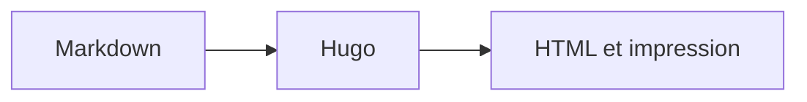

+++
title = "Diagrammes"
description = "Afficher des diagrammes Mermaid responsives depuis Markdown."
weight = 120
icon = "chart-dots"
+++

[Mermaid](https://mermaid.js.org/) produit un diagramme depuis du texte. Un bloc
`mermaid` charge le moteur uniquement sur les pages concernées.



````md

````
