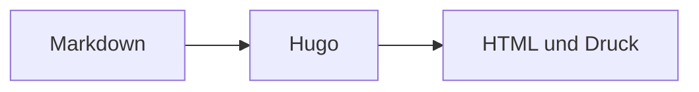

# Diagramme

> Responsive Mermaid-Diagramme aus Markdown rendern.


[Mermaid](https://mermaid.js.org/) erzeugt Diagramme aus Text. Ein
`mermaid`-Codeblock lädt die Laufzeit nur auf Seiten, die sie benötigen.



````md

````


---
Quelle: https://projectious-work.github.io/brand-theme-hugo-vanilla/v0.3.1/de/docs/features/diagrams/index.md
