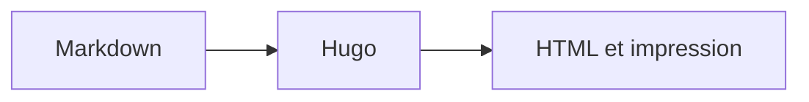

# Diagrammes

> Afficher des diagrammes Mermaid responsives depuis Markdown.


[Mermaid](https://mermaid.js.org/) produit un diagramme depuis du texte. Un bloc
`mermaid` charge le moteur uniquement sur les pages concernées.



````md

````


---
Source: https://projectious-work.github.io/brand-theme-hugo-vanilla/v0.3.1/fr/docs/features/diagrams/index.md
