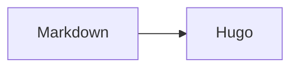

# Shortcodes

> Référence des composants structurés fournis par le thème.

Utilisez d'abord Markdown. Les shortcodes sont réservés aux composants structurés.
La [référence anglaise](/docs/shortcodes/) montre le code complet; les exemples
essentiels sont traduits ci-dessous.

## Callout, cartes et onglets

Un complément utile au lecteur.


  
  



  `npm install`
  `hugo server`


## Étapes, détails et arborescence


  Ajoutez le module Hugo.
  Copiez les formats de sortie.
  Exécutez le script de test.


Titres, descriptions, tags, contenu et titres H2/H3.



## Terminal, diagramme et mathématiques


$ hugo server
Watching for changes
Built in 284 ms
Web Server is available at http://localhost:1313/


Formule en ligne: \( E = mc^2 \).

La liste complète des paramètres, y compris `icon`, `badge`, `button`, `term`,
`image`, `asciinema` et `notebook`, se trouve dans le
[guide de rédaction](guides/_index.md).

---
Source: https://projectious-work.github.io/brand-theme-hugo-vanilla/v0.3.2/fr/docs/shortcodes/index.md
